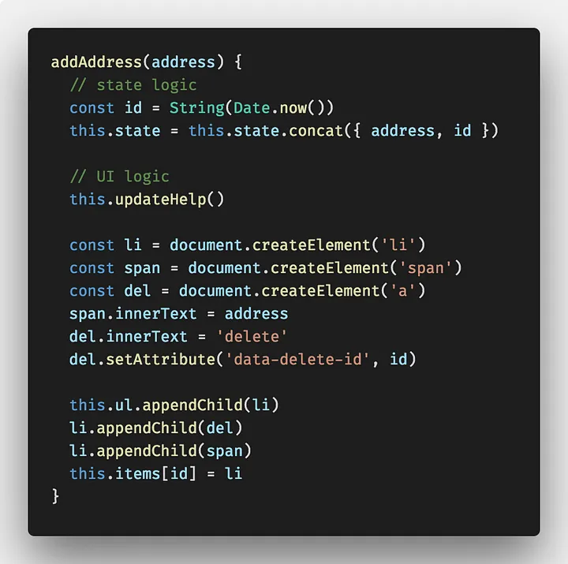

# Why modern javaScript frameworks (like React, Angular and Vue) exist and What is the problem that try to solve ?

Before React.js, We as web developers had to do things manually and add watchers for every DOM element and bind it with the help of JavaScript or jQuery.
It was fine for managing applications that are not very interactive, but what is the problem that will occur if we build a very interactive application ?

Let's see this example : [https://codepen.io/gimenete/embed/vRZLrq?](https://codepen.io/gimenete/embed/vRZLrq?)

The code illustrates very well the amount of work needed to make a somewhat complex UI with vanilla JavaScript _*(using classic libraries such as jQuery would have been similar)*_.

Let's discuss the problems :

- In the example the static structure is created in the HTML, whereas the dynamic stuff is created in JavaScript (with `document.createElement`). This is the first problem: the JavaScript code that builds the UI is not very readable and we are defining the UI in two different parts. We could have used `innerHTML` and it could have been more readable but it has more issues .. see [https://www.geeksforgeeks.org/what-is-the-disadvantage-of-using-innerhtml-in-javascript/](https://www.geeksforgeeks.org/what-is-the-disadvantage-of-using-innerhtml-in-javascript/).

- The main problem is **_always updating the UI on every state change_**. Every time the state is updated there is a lot of code required to update the UI. When adding an email address in the example it takes 2 lines of code to update the state, but 13 lines to update the UI. And we made the UI as simple as possible!!

 

So, These frameworks provide lots of interesting things, but usually people miss the point about the deepest reason of their existence, which is not:

- They are based on components.
- They have a strong community.
- They have useful third party components.
- They have browser extensions that help debugging things.
- They are good for doing single page applications.

No, **_The main problem these frameworks try to solve is_** :

<i><b>"Keeping The UI In Sync With State Is HARD"</b></i>

#### Resources

- [https://www.quora.com/What-does-react-js-try-to-solve-Can-you-provide-a-practical-example](https://www.quora.com/What-does-react-js-try-to-solve-Can-you-provide-a-practical-example)
- [https://medium.com/@aankit35/what-problem-does-react-js-solve-for-software-developers-a06cf50be28a](https://medium.com/@aankit35/what-problem-does-react-js-solve-for-software-developers-a06cf50be28a)
- [https://medium.com/dailyjs/the-deepest-reason-why-modern-javascript-frameworks-exist-933b86ebc445](https://medium.com/dailyjs/the-deepest-reason-why-modern-javascript-frameworks-exist-933b86ebc445)
- [https://www.reddit.com/r/webdev/comments/y42mq5/what_problems_does_react_solve/](https://www.reddit.com/r/webdev/comments/y42mq5/what_problems_does_react_solve/)
- [https://blog.eduonix.com/web-programming-tutorials/learn-react-framework-problems-solves/](https://blog.eduonix.com/web-programming-tutorials/learn-react-framework-problems-solves/)
