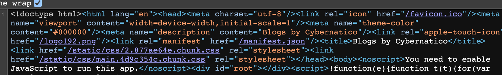
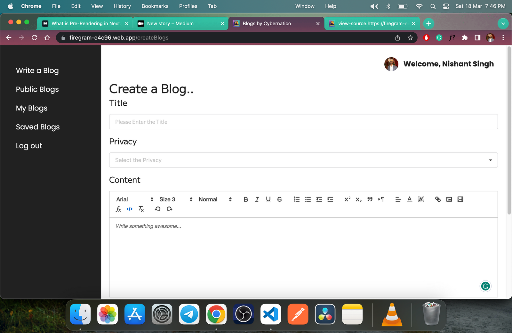

# Why NextJs while React is exist ?

As react.dev docs said [here](https://react.dev/learn/start-a-new-react-project) :

> If you want to build a new app or a new website fully with React, we recommend picking one of the React-powered frameworks popular in the community. Frameworks provide features that most apps and sites eventually need, including routing, data fetching, and generating HTML.

but, why is recommended to use one of the React-powered frameworks popular in the community like Next.js, Remix, Gatsby and Expo (for native apps) and What is NextJs ?

## Next Js "The React Framework for the Web"

Next.js is a flexible React framework that gives you building blocks to create fast web applications.

By framework, we mean Next.js handles the tooling and configuration needed for React, and provides additional structure, features, and optimizations for your application.

### Building Blocks of a Web Application

There are a few things you need to consider when building modern applications. Such as:

- User Interface - how users will consume and interact with your application.
- Routing - how users navigate between different parts of your application.
- Data Fetching - where your data lives and how to get it.
- Rendering - when and where you render static or dynamic content.
- Integrations - what third-party services you use (CMS, auth, payments, etc) and how you connect to them.
- Infrastructure - where you deploy, store, and run your application code (Serverless, CDN, Edge, etc).
- Performance - how to optimize your application for end-users.
- Scalability - how your application adapts as your team, data, and traffic grow.
- Developer Experience - your team’s experience building and maintaining your application.

Let's see how Next Js handle some of these building blocks vs React :

#### UI (User Interface)

React is a _*"Javascript UI library created by Meta"*_ and NextJs is _*"The React Framework for the Web"*_. So Next.js is built on top of React. It is a framework built on top of React Library. Although if you are eager to start learning Next.js then I would recommend you to first learn the basics of React such as _*functional components, hooks and JSX*_. Only then you’ll be able to understanding the concepts of Next.js.

**_So, Next Js Build UI as React (already write React) with some features added like pre-rendering, faster compilation, automatic building size optimization and much more._**

<div align="center">______________________________________________________________</div>

#### Routing

As we said **_"React Is Just UI library"_** .. It doesn't have built in routing system, and to handle routing in React we need to use external package [react-router-dom](https://www.npmjs.com/package/react-router-dom).
<br/>
but,
<br/>
Next Js is **_"Framework"_** .. it has a [file-system based router built on the concept of pages](https://nextjs.org/docs/routing/introduction).

<div align="center">______________________________________________________________</div>

#### Data Fetching & Rendering

I Will discuss rendering techniques in _*"3- Rendering (CSR vs Pre-rendering [SSR, SSG, ISG] )"*_ folder.<br/>

but now let's see how React vs NextJs rendering.<br/>

when we load a React application and we check the source code in the browser, we get something like this:

<div align="center"></div>
<br/>

And if you simplify this, we get the following:

```html
<html lang="en">
  <head>
    <meta charset="utf-8" />
    <link rel="icon" href="/favicon.ico" />
    <meta name="viewport" content="width=device-width,initial-scale=1" />
    <meta name="theme-color" content="#000000" />
    <meta name="description" content="Blogs by Cybernatico" />
    <link rel="apple-touch-icon" href="/logo192.png" />
    <link rel="manifest" href="/manifest.json" />
    <title>Blogs by Cybernatico</title>
    <link href="/static/css/2.877ae64e.chunk.css" rel="stylesheet" />
    <link href="/static/css/main.4d9c354c.chunk.css" rel="stylesheet" />
  </head>
  <body>
    <noscript>You need to enable JavaScript to run this app.</noscript>
    <div id="root"></div>
    <script src="/static/js/2.48c493c5.chunk.js"></script>
    <script src="/static/js/main.f9b5cf72.chunk.js"></script>
  </body>
</html>
```

And if you look at the output in the UI, it will be something like this:

<div align="center"></div>
<br/>

In the source code of this page, we only get a few lines of code which include the title, meta tags, and link references.

But in the body, we only have this:

```html
<div id="root"></div>
```

_*So, where is the rest of the code?*_

We don’t see it in the browser when the page loads. This is because React uses **_client-side rendering (CSR)_**. A React application processes the DOM on the client side, that is in the browser.

Whenever we load a React application, all the UI components get generated on the browser, dynamically.

If you do the same things we did before, but with a Next.js app, you will get something different:

```html
<!DOCTYPE html>
<html lang="en">
  <head>
    <meta charset="utf-8" />
    <title>Next.js Tutorial</title>
    <meta name="description" content="This is a Next.js Tutorial" />
    <meta name="viewport" content="width=device-width, initial-scale=1" />
    <link rel="icon" href="/favicon.ico" />
    <meta name="next-head-count" content="5" />
    <noscript data-n-css=""></noscript>
  </head>
  <body>
    <div id="__next">
      <div>
        <h2>This is the Home Page!</h2>
        <a href="/profile/1"><p>Go to the Profile Page of 1!</p></a>
      </div>
    </div>
  </body>
</html>
```

Now, this is the source code of a simple Next.js app. We see the entire contents, like the HTML, CSS, and JavaScript.

This means that when a Next.js app loads, the content on the web that we see on the UI is already generated. And this takes place on the server. This is because Next.js utilizes **_server-side rendering (or SSR), also known as pre-rendering_**.

The **_pre-rendering (SSR or SSG)_** makes an application load faster. This is because the output we are going to see is already generated on the server side. It does not need to be generated on the browser. `This makes a server-side app faster than one on the client side`. and `best for SEO` because, the search engine sees full page structure in pre-rendering other than the HTML to render is produced on the client-side, so search engines must execute the JavaScript code for getting the HTML.

<div align="center">______________________________________________________________</div>

#### Performance

Next.js provides a number of features that are not available in React.js, or which are available only with additional configuration and/or plugin libraries.

- Next.js' code splitting and lazy loading capabilities mean that pages load faster, as only the necessary code is loaded on demand. This can be a significant `performance boost`, especially on mobile devices.

- Next.js' server-side rendering support means that pages can be rendered on the server before being sent to the client, providing a `performance boost and better SEO`.

- Next.js' Built-In CSS Support, Image Component, Image Optimization and Optimizing Fonts , providing a `performance boost` to your application.

- Next.js supports hot module reloading, which means that changes made to the code during development will be automatically reflected in the browser, without the need to refresh the page.

### Benefits in the World of Next JS (What NextJs is Good For?)

There have to be some remarkable benefits for it to be regarded better than React in some cases and there definitely are.
Following are the benefits of using Next JS :

- Better SEO(search engine optimization)

By opting for SSR instead of client-rendered JavaScript, you can up your game of visibility considerably in the search engine. It will give you the liberty to create an application that has all the desired functionalities and is interactive as per your requirements but at the same time `gives all the SEO benefits` of a static text-based website. This will put you at a better competitive advantage.<br/>
_*But, how many developers take into consideration the SEO factor while developing an app is a pertinent question to this discussion. As per the State of frontend report, more than half of the developers don’t consider SEO as an important factor while developing an app.*_

- Better looking URLs

Next JS comes off with an added feature to improve the social media booting of your application. It allows you to programmatically customize your open graph meta titles for each page which ultimately makes your URLs more accessible for social media to boot. `This improves SEO as a whole`.

- Enhanced performance

It is better in terms of performance and can greatly enhance the performance of your application adding to the overall user experience. It takes into consideration the time a user will have before he looks at the content on your website and keeps it under 1 second ideally. Users value applications that load faster and save them time. _*That is why it plays an important role in keeping the customers hooked to your application.*_

#### The Objectives for Opting Next JS

If you will to determine when you should adopt Next JS and how it can help you achieve set goals and objectives then you need to define your objectives. Following are the line of objectives/goals that can be achieved using Next JS.

- Increase in sales and conversion rates
- Better marketing and reach
- Enhanced user experience
- Offers scalability
- Competitive edge

#### The Right Time for Using Next JS

What projects would work better if done with Next JS? In the words of **_Rafał Kucharski, Lead Frontend Developer at a Software House_**:

> “When you consider SEO and organic traffic to be important for your business, strive to cut the time to first draw or need [OG tags](https://ahrefs.com/blog/open-graph-meta-tags/), Next is the right choice. E-commerce is one area in which all of these apply. But the same goes for any web portal, blog, or even social and streaming service. Of course, we always analyze the needs and expectations of each client individually and then make recommendations, but this is a good rule of thumb in this case.<br/>For us, React applications are the starting point. Next.js is what we suggest when the analysis finds that SSR is going to be beneficial for the client. This is typically the case with applications that are available to the public and accessing their content doesn’t require authorization.”

<hr />

##### Resources

- [https://radixweb.com/blog/nextjs-vs-react](https://radixweb.com/blog/nextjs-vs-react)
- [https://mobisoftinfotech.com/resources/blog/next-js-vs-react/](https://mobisoftinfotech.com/resources/blog/next-js-vs-react/)
- [https://javascript.plainenglish.io/why-next-js-has-better-seo-than-plain-react-6f6646d776e8](https://javascript.plainenglish.io/why-next-js-has-better-seo-than-plain-react-6f6646d776e8)
- [https://bootcamp.uxdesign.cc/10-reasons-why-next-js-is-the-superior-choice-over-create-react-app-for-your-next-project-bce8addfe27c](https://bootcamp.uxdesign.cc/10-reasons-why-next-js-is-the-superior-choice-over-create-react-app-for-your-next-project-bce8addfe27c)
- [https://ninetailed.io/blog/next-js-vs-react/#What%20Is%20React](https://ninetailed.io/blog/next-js-vs-react/#What%20Is%20React)
- [https://www.quora.com/What-are-the-advantages-that-exist-in-Next-js-and-dont-exist-in-React-js](https://www.quora.com/What-are-the-advantages-that-exist-in-Next-js-and-dont-exist-in-React-js)
- [https://www.quora.com/What-are-the-advantages-of-Next-js-over-React-js](https://www.quora.com/What-are-the-advantages-of-Next-js-over-React-js)
- [https://invozone.com/blog/what-is-next-js-and-why-should-you-use-it/](https://invozone.com/blog/what-is-next-js-and-why-should-you-use-it/)
- [https://www.freecodecamp.org/news/next-vs-react/](https://www.freecodecamp.org/news/next-vs-react/)
