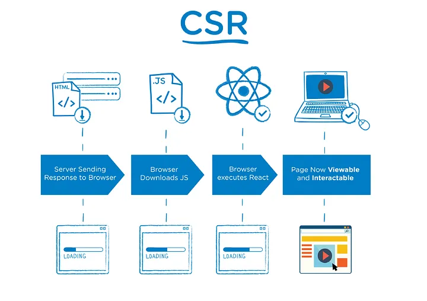
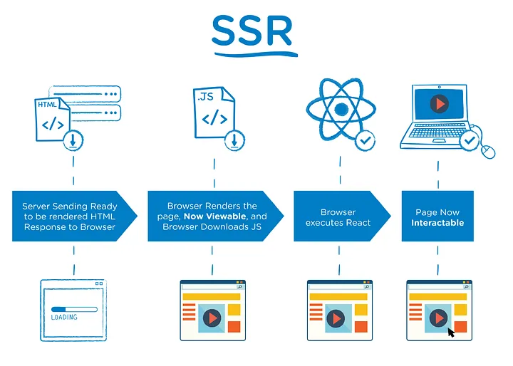
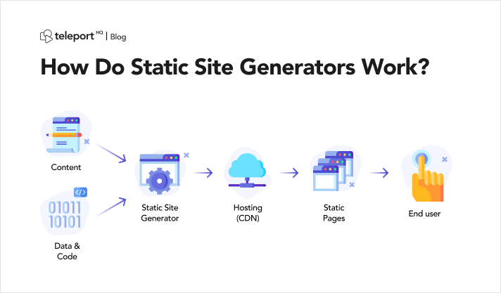

# Rendering (CSR vs Pre-rendering [SSR, SSG, ISG] )

As developers, we are often faced with decisions that will affect the entire architecture of our applications. One of the core decisions web developers must make is where to implement logic and rendering in their application. This can be difficult, since there are a number of different ways to build a website.

In order to better understand the architectures we’re choosing from when we make this decision, we need to have a solid understanding of each approach and consistent terminology to use when speaking about them. The differences between these approaches help illustrate the trade-offs of rendering on the web through the lens of performance.

Let's see every rendering techniques :

## CSR (Client Side Rendering)

**_Client-side rendering (CSR)_** is a web development approach where the **_web browser is responsible for rendering_** the web page's content. 
In this approach, the server sends the client a bare-bones HTML file that includes a minimal amount of content, such as the document's title and basic structure. The JavaScript code on the page then fetches the remaining data from a server API and dynamically populates the page with the content.

### How it works:

- Build process ⇒ The HTML file is sent to the server
- When the user requests, the server will send the HTML file, then the client (browser) requests the data to the API server

> Note: In Next 13, you need to add [`‘use client’`](https://www.js-craft.io/blog/client-components-use-client-directive-nextjs-13/) at the top of your jsx/tsx file to let Next.js know it’s rendered on the client side.

- At the time the client is requesting data from the API server, the browser will display the _loading-state_ (in most cases)
- After the data is fetched from the API server, then the _loading-state_ will be turned off and the screen will be updated with the data from the API

### Use Cases

- If your site’s data is updated frequently
- SEO is not an essential factor

Ex: Dashboards, Social Media (like facebook, instagram), Tasks Managment websites

### Pros

- Real-time data
- The burden is not too big for the server
- Scalability ⇒ CSR can be scalable since the server's primary role is to provide the data, while the browser is responsible for rendering the content. that's mean there's **_NO_** server load and reduced performance as the number of users increases.

### Cons

- There will be a loading-state
- Not good for SEO ⇒ Since the HTML built from the server is not including the data from the API
- Slower initial loading times ⇒ Because the browser first will render a blank page, and user wait js code to execute and get data from server to see the page content. This can lead to a poor user experience, especially for users with slower internet connections or lower-end devices.

## SSR (Server Side Rendering)

**_Server-side rendering (SSR))_** is a web development approach where the **_server generates the HTML for the web page_** and sends it to the client's browser. 
In this approach, the server is responsible for rendering the content, which means that the user must wait for the server to generate and send the HTML before being able to interact with the page.

### How it works:

- The JS file is sent to the server
- When the user (browser) requests, the server will run the `getServerSideProps()` function (Next 12) or `fetch(‘https://...', { cache: ‘no-store’ });` (Next 13)
- After the data is fetched, it will be built on the server _(including the data from the API)_
- The server will send the HTML to the user’s browser

### Use Cases

- If your site data is updated frequently and need a fresh data every rendering
- While at the same time, SEO is an essential factor as well

Ex: News, Blogs, Banks, Stock exchange websites

### Pros

- No loading-state
- Real-time data
- Good for SEO
- Improved security ⇒ SSR can be more secure since the server has full control over the content that is rendered on the page, reducing the risk of client-side attacks such as cross-site scripting (XSS).

### Cons

- The user needs to wait for the HTML to be built on the server-side
- Too much burden on the server ⇒ every user’s request, the server needs to rebuild
- Slower initial loading times ⇒ Since the user must wait for the server to generate and send the HTML. This can lead to a poor user experience, especially for users with slower internet connections or lower-end devices.
- Scalability ⇒ SSR can be less scalable since the server is responsible for rendering the content, which can result in increased server load and reduced performance as the number of users increases.

## SSG (Static Site Generation)

**_Static site generation (SSG)_** is a web development approach where the server generates a static HTML file for each page of the web application at **_build time_**. 
In this approach, the server generates the HTML _(Pre-Generating or Pre-Rendering)_ and sends it to the client's browser, which means that the user can _interact with the page almost immediately_, without the need for additional data to be fetched and rendered dynamically.

### How it works:

- The build and fetch data process happened at the same time ⇒ `getStaticProps()` function (Next 12) or `fetch()` function (it’s set as default in Next 13) is running at build time
- After the _HTML + JSON_ is built (the data from API is included), it will be sent to the server
- When the user (browser) requests, the server will send the HTML + JSON file immediately, so the user doesn’t need to wait (no loading!)

### Use Cases

- If your site data is definite **_(fetch once and that’s it)_**
- While at the same time, SEO is an essential factor as well

Ex: site for Al-Qur’an, logs/history data, or old archived documents — which won’t be changed no matter what

### Pros

- Overall the fastest method
- No loading
- The burden is not too big for the server
- Good for SEO
- Improved security ⇒ SSG can be more secure since there is no server-side code that can be vulnerable to attacks.
- Cost-effective ⇒ SSG can be more cost-effective since there is no need for expensive server-side infrastructure to handle dynamic content.
- Easy deployment ⇒ SSG can be easier to deploy since the fully-generated HTML files can be easily uploaded to a web server or content delivery network (CDN).

### Cons

- Don’t have the trigger to update the data from API _(fetch one and that’s it)_ unless it’s redeployed
- Limited interactivity, scalability , flexibility ⇒ SSG can provide limited interactivity since the pages are pre-generated, and there is no server-side code to handle dynamic content or real-time updates

## ISR (Incremental site regeneration)

**_Incremental site regeneration (ISR)_** is a variation of the _static site generation (SSG)_ approach in web development. ISR is a technique that allows developers to _regenerate only the pages that have changed since the last build_, rather than regenerating the entire site. 
This approach can result in faster build times and improved performance, especially for large sites with many pages. 
In ISR, the server generates a fully-formed HTML page for each page of the web application at **_build time, just like in SSG._** However, when a change is made to a page, the server only generates that page, rather than regenerating the entire site. The server then deploys the updated page to the web server or content delivery network (CDN), allowing users to access the updated content almost immediately.

### How it works:

- Pretty much the same with SSG, but with the capability to update the data
- If you set the **_revalidated data_** on the `getStaticProps()` function (Next 12) or `fetch(‘https://.../data', { next: { revalidate: 10 } });` (Next 13), the server will revalidate the data from the API and see whether there’s any change
- If there’s any update from the API (DB), then the built HTML file will be updated _(the new one will overwrite the current one)_
- But, it will only be updated after the set time in revalidate props time is passed
- Example: If you set `revalidate: 10` ⇒ It will do the revalidation and update the HTML after 10 seconds are passed

### Use Cases

- Best practice for most static sites that don’t need a real-time update

Ex: Personal, Documentation of software libraries or APIs, Blogs, Events websites and Landing pages

### Pros

- Basically, it’s SSG (fast + good for SEO!) but with an additional tweak to be able to update the site’s data

### Cons

- Can’t be used if you have a real-time feature on your site

## Conclusion

If your site (or site-content) conditions are:

- Doesn’t have personalized content, doesn’t need to update the site data, and SEO is an important factor ⇒ SSG
- Doesn’t have personalized content, needs to update the site data (non-real-time), and SEO is an important factor ⇒ ISR
- Need to update the data frequently, has personalized content, and SEO is an important factor ⇒ SSR
- Need to update the data frequently, has personalized content, and SEO is not an important factor ⇒ CSR

> Personalized means the data is unique for each client, for example -> data in the profile page, user’s name in the navbar, etc

### Useful articles

- [How to choose between Next.js CSR, SSR, SSG, and ISR](https://theodorusclarence.com/blog/nextjs-fetch-usecase#metric-2--seo)
- [Next.js: The Ultimate Cheat Sheet To Page Rendering](https://guydumais.digital/blog/next-js-the-ultimate-cheat-sheet-to-page-rendering/)

and here Live Demo to see [CSR vs SSR vs SSG vs ISR](https://csr-ssr-ssg-ssr.vercel.app/)

#### Resources

- [https://medium.com/@idrazhar/ssr-ssg-isr-csr-in-next-js-the-ultimate-guide-9d1b90aa995e](https://medium.com/@idrazhar/ssr-ssg-isr-csr-in-next-js-the-ultimate-guide-9d1b90aa995e)
- [https://mrizkiaiman.medium.com/understanding-next-js-rendering-strategies-2023-ssr-csr-ssg-isr-9ffb792cf757](https://mrizkiaiman.medium.com/understanding-next-js-rendering-strategies-2023-ssr-csr-ssg-isr-9ffb792cf757)
- [https://www.juango.dev/posts/ssr-csr-ssg-isr](https://www.juango.dev/posts/ssr-csr-ssg-isr)
- [https://theodorusclarence.com/blog/nextjs-fetch-usecase#metric-2--seo](https://theodorusclarence.com/blog/nextjs-fetch-usecase#metric-2--seo)
- [https://nextjs.org/learn/basics/data-fetching/pre-rendering](https://nextjs.org/learn/basics/data-fetching/pre-rendering)
- [https://guydumais.digital/blog/next-js-the-ultimate-cheat-sheet-to-page-rendering/](https://guydumais.digital/blog/next-js-the-ultimate-cheat-sheet-to-page-rendering/)
- [https://web.dev/rendering-on-the-web/](https://web.dev/rendering-on-the-web/)
- ChatGPT
